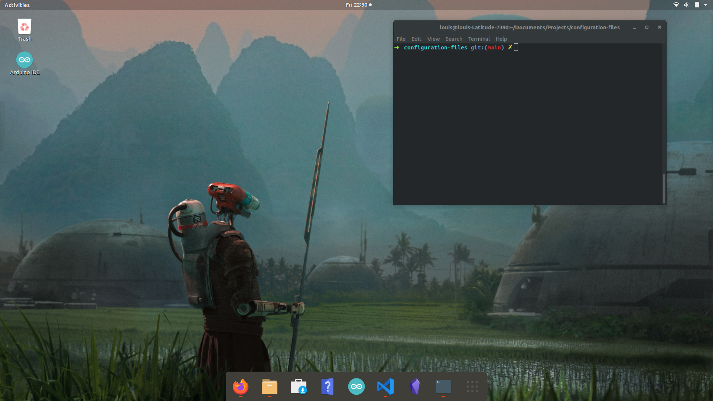

# Ubuntu 18.04 Setup Guide
Author: [Louis Jarvis](mailto:louisjarvisnz@gmail.com)

Follow these steps to supercharge your Ubuntu 18.04 distribution with essential tools, customizations, and productivity enhancements.



---

## Table of Contents
1. [Development Tools](#development-tools)
2. [Installing Oh-My-Zsh](#installing-oh-my-zsh)
    - [Plugins and Fonts](#plugins-and-fonts)
    - [Changing Default Shell](#changing-default-shell)
3. [GNOME Style Customizations](#gnome-style-customizations)
    - [GNOME Tweaks](#gnome-tweaks)
    - [Vimix Icon Theme](#vimix-icons)
4. [Dash-to-Dock](#dash-to-dock)

---

## Development Tools

To set up your development environment, start by installing Python and Pyenv using the provided script.

### Install Python and Pyenv
1. Clone the repository or download the `install_tools.zsh` script.
2. Make the script executable and run it:
   ```zsh
   chmod +x install_tools.zsh
   sudo ./install_tools.zsh 3.11.5
   ```
   Replace `3.11.5` with your preferred Python version if necessary.

---

## Installing Oh-My-Zsh

Enhance your terminal with **Oh-My-Zsh**, a powerful Zsh configuration framework.

### Installation

1. Run the following command to install **Oh-My-Zsh**:
   ```zsh
   sh -c "$(curl -fsSL https://raw.github.com/robbyrussell/oh-my-zsh/master/tools/install.sh)"
   ```

2. Install required tooling:
   ```zsh
   sudo apt-get install -y git-core zsh fonts-powerline
   ```

---

### Plugins and Fonts

1. Install **zsh-autosuggestions**:
   ```zsh
   git clone https://github.com/zsh-users/zsh-autosuggestions ${ZSH_CUSTOM:-~/.oh-my-zsh/custom}/plugins/zsh-autosuggestions
   ```

2. Enable the plugin:
   - Open your Zsh configuration file:
     ```zsh
     vi ~/.zshrc
     ```
   - Locate the `plugins` section, and modify it as follows:
     ```zsh
     plugins=(git zsh-autosuggestions)
     ```
   - Save and close the file.

3. Restart Zsh to apply the changes:
   ```zsh
   source ~/.zshrc
   ```

---

### Changing Default Shell

Set Zsh as your default shell:
```zsh
chsh -s $(which zsh)
```
After setting, restart the terminal or run:
```zsh
exec zsh
```

---

## GNOME Style Customizations

Enhance the visual appearance of your Ubuntu 18.04 GNOME desktop.

### GNOME Tweaks

1. Add the required repository and install **GNOME Tweaks**:
   ```zsh
   sudo add-apt-repository universe
   sudo apt install gnome-tweaks
   ```

2. Launch **GNOME Tweaks** to start customizing:
   ```zsh
   gnome-tweaks
   ```

---

### Vimix Icon Theme

The **Vimix Icon Theme** provides a polished look for your desktop.

1. Clone the repository and run the installer:
   ```zsh
   git clone https://github.com/vinceliuice/Vimix-icon-theme.git
   cd Vimix-icon-theme
   ./install.sh
   ```

2. Apply the icons using **GNOME Tweaks** under the **Appearance** section.

---

## Dash-to-Dock

Add a customizable dock for better application navigation.

Follow the [official Dash-to-Dock installation guide](https://micheleg.github.io/dash-to-dock/download.html) for detailed instructions.

---

### Notes and Tips

- Always back up your configuration files before making changes.
- For more Zsh plugins, themes, and configurations, explore the [Oh-My-Zsh plugins directory](https://github.com/ohmyzsh/ohmyzsh/wiki/Plugins).

---
